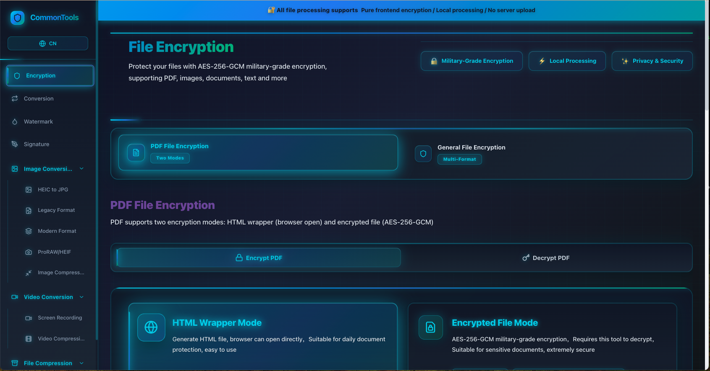

# CommonTools - Free Online Tools | Image Tools, Video Tools, File Tools | Privacy-First Processing

> **CommonTools** - Professional free online tools for image processing, video editing, and file management. All tools process files locally in your browser, ensuring 100% privacy protection with no file uploads to servers.

## Table of Contents

- [Introduction](#introduction)
- [Key Features](#key-features)
- [Image Tools](#image-tools)
- [Video Tools](#video-tools)
- [File Tools](#file-tools)
- [Competitor Analysis](#competitor-analysis)
- [Installation & Usage](#installation--usage)
- [Team](#team)
- [Contributing](#contributing)
- [License](#license)
- [Last Update](#last-update)

## Introduction

CommonTools is a comprehensive suite of free online tools designed for professional image processing, video editing, and file management. Unlike traditional online tools that require uploading files to servers, CommonTools processes everything locally in your web browser using advanced JavaScript APIs. This ensures complete privacy protection - your files never leave your device.

### Why Choose CommonTools?

- **Privacy-First**: 100% local processing, no file uploads
- **Professional Quality**: Advanced algorithms for optimal results
- **Batch Processing**: Handle multiple files simultaneously
- **Cross-Platform**: Works on any modern web browser
- **Free & Open Source**: No hidden costs or premium features
- **Fast & Efficient**: Optimized for performance

### Supported Formats

**Images**: PNG, JPG, WebP, AVIF, BMP, TGA, PCX, TIFF, HEIC, HEIF, ProRAW (DNG)  
**Videos**: MP4, MOV, AVI, WebM, M4V, GIF  
**Documents**: PDF, DOC, DOCX, TXT, and more  
**Archives**: ZIP with AES-256 encryption support

## Key Features

- 🖼️ **Advanced Image Compression** - Batch processing with multiple formats, lossy/lossless options
- 🔄 **Format Conversion** - Convert between modern and legacy image formats
- 🎥 **Video Compression & Editing** - Professional video processing with multiple codecs
- 🔐 **File Encryption** - Military-grade AES-256-GCM encryption for all file types
- 💧 **Watermark Tools** - Add professional watermarks to PDFs and images
- ✍️ **Electronic Signatures** - Drag-and-drop signature placement on documents
- 📱 **iPhone Optimized** - Special tools for HEIC, ProRAW, and screen recordings
- 📦 **Archive Management** - ZIP compression/decompression with encryption

## Image Tools

### Professional Image Compression
Batch process images with advanced compression algorithms. Support for JPG, PNG, WebP, GIF, TIFF, AVIF formats. Features include:
- Lossy and lossless compression modes
- Target size control
- Resolution scaling
- Auto best format selection
- 100% local processing for privacy

[Try Image Compression Tool](https://commontools.top/tools/legacy-image-converter)

### Legacy Image Format Converter
Convert outdated formats like BMP, TGA, PCX, TIFF to modern JPG or WebP. All processing happens locally to protect your privacy.

[Legacy Image Converter](https://commontools.top/tools/legacy-image-converter)

### Modern Image Format Converter
High-quality batch conversion between AVIF/WebP and PNG/JPG with real-time preview and quality control.

[Modern Image Format Converter](https://commontools.top/tools/modern-image-converter)

### HEIC to JPG Converter
Convert iPhone HEIC/HEIF images to universal JPG format. 100% browser local processing, privacy protected.

[HEIC to JPG Converter](https://commontools.top/tools/heic-to-jpg)

### ProRAW / HEIF Professional Converter
Batch convert iPhone ProRAW (.DNG) and HEIF Burst photos to JPG with selective EXIF metadata retention.

[ProRAW / HEIF Pro Converter](https://commontools.top/tools/proraw-converter)

## Video Tools

### Professional Video Compression
Batch video compression with multiple formats (MP4/MOV/AVI/WebM/M4V). Supports H.264/VP9 encoding, CRF/bitrate/size modes.

[Video Compression Tool](https://commontools.top/tools/video-compression)

### iPhone Screen Recording Editor
Optimized for iPhone screen recordings: crop status bar, compress size, adjust quality. Uses native browser APIs.

[iPhone Screen Recording Editor](https://commontools.top/tools/screen-recording)

## File Tools

### Document Format Conversion
High-quality document conversion with 100% browser local processing, no file upload required.

[Format Conversion Tool](https://commontools.top/tools/conversion)

### File Encryption
Protect files with AES-256-GCM military-grade encryption. Supports PDF, images, documents, text files and more.

[File Encryption Tool](https://commontools.top/tools/Encryption)

### PDF Watermark Tool
Add professional watermarks to PDFs and images. Supports Chinese/English text, custom opacity and rotation.

[Watermark Tool](https://commontools.top/tools/watermark)

### Electronic Signature
Add handwritten signatures and date stamps anywhere on PDF documents. Supports drag and resize functionality.

[Electronic Signature Tool](https://commontools.top/tools/signature)

### File Compression/Decompression
ZIP format compression and decompression with AES-256 encryption support. 100% browser local processing.

[File Compression Tool](https://commontools.top/tools/compression)

## Competitor Analysis

### Image Tools Competitors
- **imagestool.com**: Process images online without uploading files
- **ImageTools.org**: Simple and Free Image Tools
- **OnlineTools.com**: Online Image Tools - Simple, free and easy to use
- **TinyPNG**: Compress AVIF, WebP, PNG and JPEG images intelligently
- **Canva**: AI image generator with text prompts

### Video Tools Competitors
- **Clideo**: Video editor with subtitles, compress, resize, cut, crop, merge, speed controls
- **Adobe Express**: Free video editor for professional videos in minutes
- **Canva**: Drag-and-drop online video editor and maker
- **Atlassian Loom**: 11 Powerful AI Video Tools for 2025
- **videotools.io**: Curated Tools & Assets for Video Creators
- **Vimeo**: Free Online Video Maker and Editor Tools

### File Tools Competitors
- **Online File Tools**: Simple, free and easy to use file processing utilities
- **Softonic**: Comprehensive file tools collection

## Installation & Usage

1. Visit [CommonTools Website](https://commontools.top/tools/)
2. Choose your desired tool from the menu
3. Select files directly from your device
4. Process files locally in your browser
5. Download processed files instantly

No installation required - works directly in any modern web browser!

## Team

**CommonTools Development Team**  
Website: [https://commontools.top/](https://commontools.top/)  
Contact: support [at] commontools.top  
Location: International

## Contributing

We welcome contributions! Please see our [Contributing Guidelines](CONTRIBUTING.md) for details.

## License

This project is licensed under the MIT License - see the [LICENSE](LICENSE) file for details.

## Thanks

Thanks to all users who provide feedback and suggestions  
Special thanks to the open-source community for their invaluable contributions

## Last Update

2026-01-27

