# CommonTools

Commonly used tools for daily life and office work（生活、办公的经常使用的工具）

## 🔧 项目简介

一个功能强大的 **本地工具集**，完全在浏览器中运行，无需上传文件到服务器，保护您的隐私安全。

基于 React 18、TypeScript 和现代 Web 技术构建，提供专业级的文件处理、图片转换、视频处理和密码管理能力。

**核心特色：**
- 🔒 100% 本地处理，文件不上传服务器
- ⚡ 基于 WebAssembly 的高性能处理
- 🎨 专业级的 UI/UX 设计
- 🔐 军事级加密保护

---

## 📋 功能模块

### 🔒 加密文件（默认首页）

- 1-1、 默认首页加解密
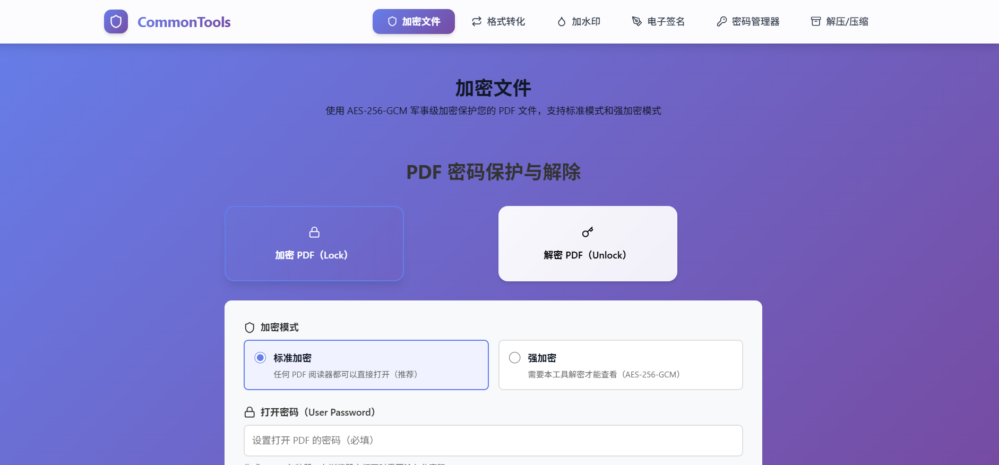

- 1-2、 首页标注加密成功


- 1-3、输入密码可以查看文件真实内容
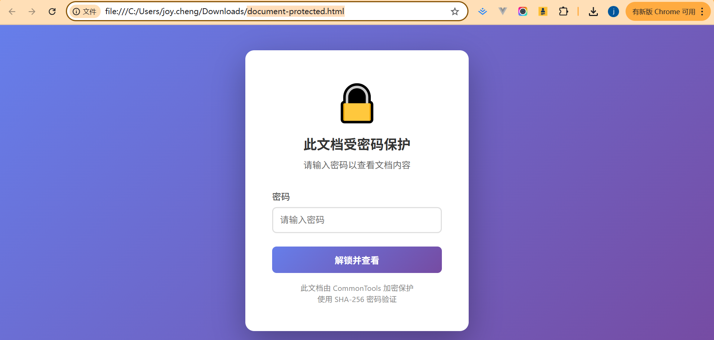


- 2-1、输入密码强加密成功文件
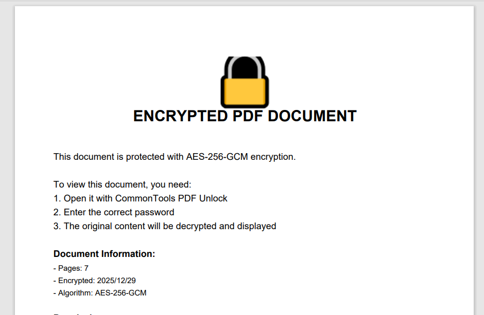

- 2-2、输入密码强解密成功
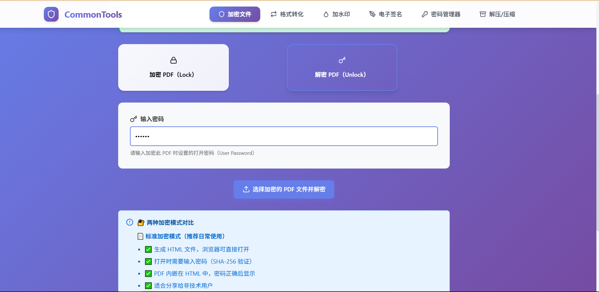


- **PDF 加密/解密**
  - 标准加密模式：HTML 包装器，浏览器可打开
  - 强加密模式：AES-256-GCM 军事级加密
  - 密码保护 + 权限控制
  - 100% 本地处理

### 🔄 格式转化
- **Word ↔ PDF**（100% 本地）
  - Word → PDF：支持中文，自动分页
  - PDF → Word：生成标准 .docx 文件
- **Markdown → PDF**
  - 实时预览
  - 支持中文和 Emoji
- **转成 PDF**（仅保留高质量功能）
  - ✅ 图片 → PDF（JPG/PNG，完美支持）
  - ✅ TXT → PDF（中英文混排，完美支持）
- **PDF 转化**（仅保留高质量功能）
  - ✅ PDF → 图片（高清 PNG，完美支持）
  - ✅ PDF → TXT（准确提取，完美支持）

### 💧 加水印

- 水印文字
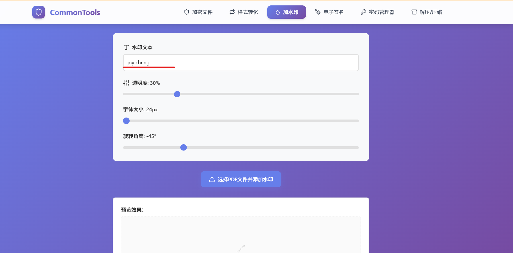

- 水印效果
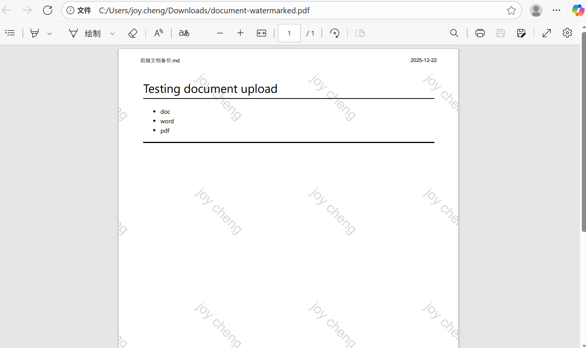

- **支持格式**：PDF、图片（JPG/PNG/BMP/WEBP/GIF）
- **PDF 水印**：平铺透明水印，完美支持中英文
- **图片水印**：Canvas 渲染，保持原图质量
- **自定义参数**：透明度、字体大小、旋转角度
- **本地处理**：100% 浏览器处理，文件不上传

### ✍️ 电子签名

- 电子签名
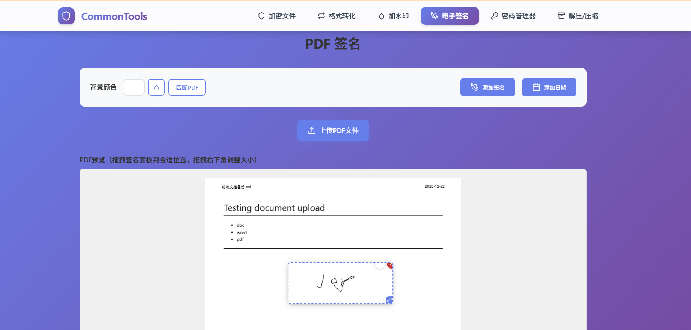
- 电子签名效果
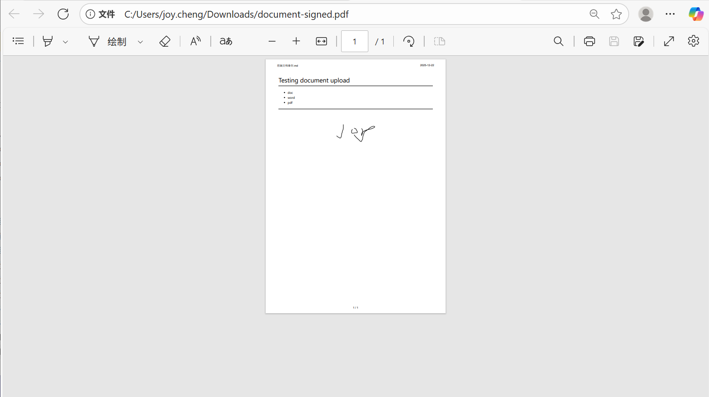

- 在 PDF 任意位置添加手写签名
- 拖拽式操作
- 手写板 + 日期面板
- 背景色匹配

### 🔐 密码管理器
- **需要主密码才能访问**
- 普通密码存储
- 重要密码（多级加密标记）
- 导入/导出功能
- 分类管理
- 复制/删除操作

### 📦 解压/压缩文件

- 压缩带密码
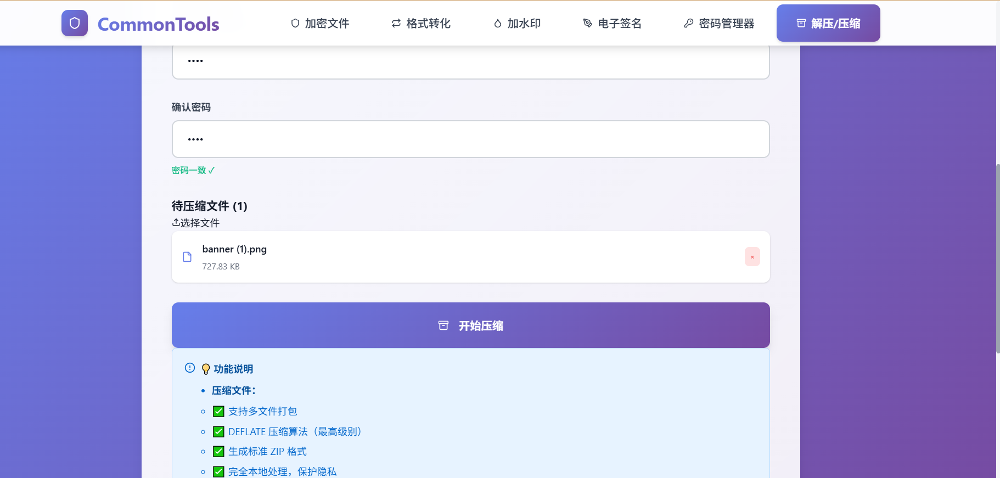

- 压缩成功


- 解压输入密码
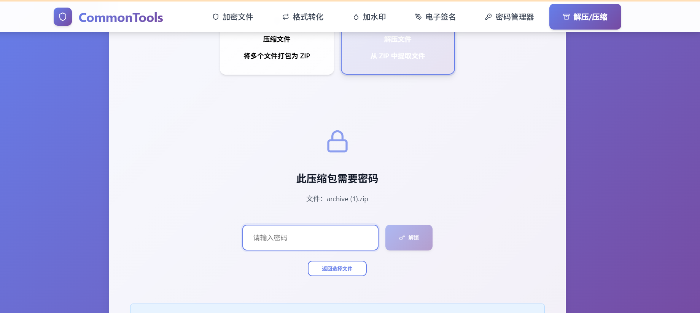

- 解压成功
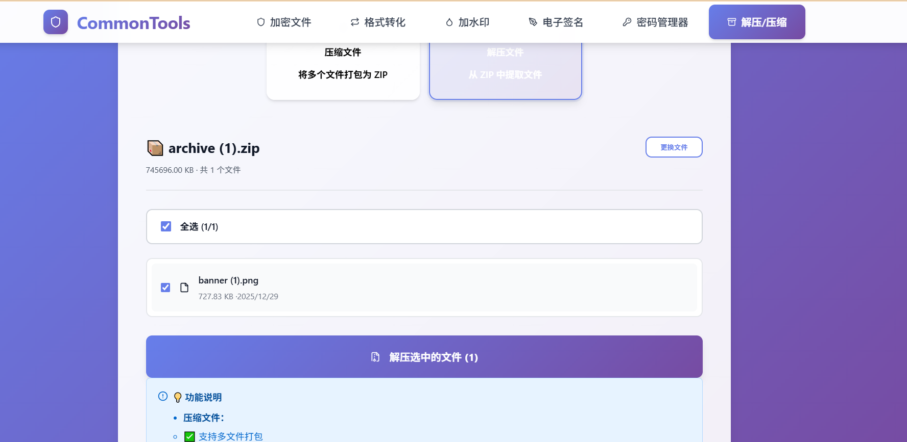

- ZIP 格式压缩（**真正的 AES-256 加密** ✅）
- ZIP 格式解压（支持加密 ZIP）
- 多文件打包
- DEFLATE 压缩算法（最高级别）
- **标准 AES-256/192/128 加密**（与 WinRAR、7-Zip 兼容）
- 文件预览和选择性解压
- 100% 本地处理

### 📷 图片转换工具

#### HEIC 转 JPG
- **iPhone 照片转换**：将 HEIC 格式转换为通用的 JPG 格式
- **批量处理**：支持一次转换多张照片
- **质量控制**：可调整输出质量和大小
- **100% 本地处理**：使用 heic2any 库，文件不上传

#### 老旧图片格式转换
- **支持格式**：BMP、TGA、PCX、TIFF（多页）
- **输出格式**：JPG、WebP
- **Canvas API**：浏览器原生处理，无需额外库
- **多页 TIFF**：支持拆分和批量导出
- **保留 DPI**：保持原始分辨率信息

#### 现代图片格式转换
- **支持格式**：AVIF、WebP ↔ PNG、JPG
- **并排对比**：实时查看转换前后效果
- **质量滑块**：精确控制输出质量
- **批量导出**：一键打包下载所有转换结果
- **Squoosh 风格 UI**：专业的对比界面

#### ProRAW 转换器
- **iPhone ProRAW**：专业摄影 RAW 格式支持
- **HEIF/HEIC 转换**：批量转换为 JPG
- **EXIF 保留**：可选择保留拍摄信息
- **元数据管理**：保留日期、相机、镜头信息
- **GPS 保护**：默认关闭地理位置信息

### 🎥 视频处理工具

#### Live Photo 转换（MOV → GIF/MP4）
- **iPhone 实况照片**：将 Live Photo 转换为动图或视频
- **MOV 转 GIF**：生成高质量动画 GIF
- **MOV 转 MP4**：转换为兼容的 MP4 格式
- **智能优化**：调色板优化、帧去重、大小压缩
- **FFmpeg.wasm**：基于 WebAssembly 的本地处理

#### iPhone 屏幕录像处理
- **智能裁剪**：去除顶部状态栏（红点、时间戳）和底部 Home bar
- **高效压缩**：H.264 编码，平均压缩 70%+ 体积
- **模糊/遮挡**：保护隐私信息（通知、消息预览）
- **批量处理**：一次处理多个视频文件
- **专业工具**：专为 iPhone 录屏优化

---

## 📚 详细功能文档

每个功能的详细使用说明：

- [HEIC 转 JPG 使用指南](./HEIC_TO_JPG_GUIDE.md) - iPhone 照片格式转换
- [Live Photo 转换指南](./LIVE_PHOTO_GUIDE.md) - 实况照片转 GIF/MP4
- [老旧图片格式转换](./LEGACY_IMAGE_CONVERTER.md) - BMP/TGA/PCX/TIFF 转换
- [现代图片格式转换](./MODERN_IMAGE_CONVERTER_GUIDE.md) - AVIF/WebP 转换
- [ProRAW 转换器](./PRORAW_QUICK_START.md) - 专业 RAW 格式处理
- [iPhone 屏幕录像处理](./SCREEN_RECORDING_GUIDE.md) - 录屏裁剪、压缩、去水印

---

## 🛠️ 技术栈

### 核心框架
- **React 18.3** - 现代化用户界面
- **TypeScript** - 类型安全
- **Vite** - 极速构建工具
- **React Router** - 路由管理

### PDF 处理
- **pdf-lib** - PDF 生成和修改
- **pdfjs-dist** - PDF 渲染和预览

### 加密与安全
- **Web Crypto API** - AES-256-GCM 加密
- **SHA-256** - 密码哈希
- **PBKDF2** - 密钥派生（100,000 次迭代）

### 文档处理
- **marked** - Markdown 解析
- **mammoth** - Word 文档处理
- **docx** - Word 文档生成
- **react-signature-canvas** - 手写签名

### 文件处理
- **@zip.js/zip.js** - ZIP 压缩和解压（支持 AES-256 加密）
- **JSZip** - ZIP 文件预览
- **file-saver** - 文件下载

### 图片处理
- **heic2any** - HEIC 格式转换
- **Canvas API** - 图片处理（编码、解码、裁剪）
- **exifreader** - EXIF 元数据读取
- **piexifjs** - EXIF 元数据写入

### 视频处理
- **@ffmpeg/ffmpeg** - FFmpeg WebAssembly（视频处理）
- **@ffmpeg/util** - FFmpeg 工具函数
- **gif.js** - GIF 动画生成

### 其他工具
- **date-fns** - 日期处理
- **lucide-react** - 图标库

---

## 🚀 快速开始

### 安装依赖

```bash
npm install
```

### 开发模式

```bash
npm run dev
```

然后在浏览器中打开 `http://localhost:3000`（或终端显示的端口）

### 构建生产版本

```bash
npm run build
```

### 预览生产构建

```bash
npm run preview
```

---

## 📖 功能详解

### 1️⃣ 加密文件（默认首页）

#### 密码设置（双重确认）
- **设置密码**：输入加密密码
- **再次确认密码**：防止输入错误
- **实时验证**：两次密码必须一致才能加密
- **视觉反馈**：错误显示红色，一致显示绿色 ✓

#### 标准加密模式
- 生成 HTML 包装器
- 浏览器打开时需要密码
- 适合日常文档分享

#### 强加密模式
- AES-256-GCM 加密
- 需要本工具解密
- 适合敏感机密文档

### 2️⃣ 格式转化

#### Word ↔ PDF（100% 本地）
- **Word → PDF**：
  - 使用 mammoth.js 提取文本
  - 使用 pdf-lib 生成 PDF
  - 支持中文（自动转图片）
  
- **PDF → Word**：
  - 使用 PDF.js 提取文本
  - 使用 docx 库生成 .docx
  - 保留段落结构

#### 其他转换
- Markdown → PDF（实时预览）
- 图片/TXT/CSV/HTML → PDF
- PDF → 图片/TXT/HTML

### 3️⃣ 加水印
- 自定义水印文本
- 调整透明度（0-1）
- 调整字体大小（1-100）
- 调整旋转角度（-180 到 180）
- 支持中文（自动转图片）

### 4️⃣ 电子签名
- 拖拽签名面板到任意位置
- 手写签名板
- 手写日期板
- 调整面板大小
- 背景色匹配（取色器）
- 调整笔触大小

### 5️⃣ 密码管理器

#### 安全特性
- 主密码保护（SHA-256 哈希）
- 首次使用设置主密码
- 数据存储在 localStorage
- 完全本地，不上传服务器

#### 功能
- 添加密码（标题、用户名、密码、网址、备注）
- 分类管理（普通/重要）
- 显示/隐藏密码
- 复制密码到剪贴板
- 删除密码
- 导出为 JSON
- 从 JSON 导入

### 6️⃣ 解压/压缩文件

#### 压缩功能
- 多文件选择
- 自定义压缩包名称
- DEFLATE 压缩（最高级别，level 9）
- **真正的密码保护（可选）✅**
  - 设置密码（最少 4 位）
  - 密码确认验证
  - **标准 AES-256 加密**
  - 与 WinRAR、7-Zip、Windows 资源管理器完全兼容
  - 使用 `encryptionStrength: 3`（最高安全级别）
- 显示压缩率和加密状态

#### 解压功能
- 支持标准 ZIP 格式（包括 AES 加密 ZIP）
- **文件预览**：加载后显示所有文件列表
- **选择性解压**：勾选需要解压的文件
- **全选/取消全选**：快速选择所有文件
- **加密 ZIP 支持**：
  - 自动检测加密 ZIP
  - 提示输入密码
  - 支持 AES-256/192/128 解密
  - 兼容 WinRAR、7-Zip 创建的加密 ZIP
- 显示文件大小、日期等信息
- 更换文件功能
- 保留原始文件名

---

## 🎯 功能特点

### ✅ 完全本地处理
- 所有操作在浏览器中完成
- 不上传文件到服务器
- 保护您的隐私和数据安全

### ✅ 中文和 Emoji 支持
- 自动将中文和 Emoji 转换为图片
- 避免 PDF 编码限制
- 完美显示各种字符

### ✅ 高 DPI 屏幕优化
- 支持 Retina 显示屏
- 手写签名清晰流畅
- 图片渲染质量高

### ✅ 现代化 UI
- 响应式设计
- 直观的操作界面
- 流畅的用户体验
- 渐变色主题

### ✅ 军事级加密
- AES-256-GCM 加密算法
- PBKDF2 密钥派生（100,000 次迭代）
- SHA-256 密码哈希

---

## ⚠️ 注意事项

### 浏览器兼容性
- 推荐使用现代浏览器：Chrome 60+、Firefox 57+、Safari 11+、Edge 79+
- 需要支持 Web Crypto API
- 不支持 IE 浏览器

### 功能限制

#### PDF ↔ Word 转换
- 仅支持文本内容，不保留复杂格式
- 无法处理表格、图片、样式等
- 如需完整格式，建议使用专业软件

#### 密码管理器
- 数据存储在 localStorage
- 清除浏览器数据会丢失密码
- 建议定期导出备份
- 主密码忘记无法恢复

#### 文件压缩/解压
- 建议单次处理文件不超过 100MB
- **真正的 AES-256 加密**（标准兼容，可被 WinRAR/7-Zip 解压）
- 大文件处理需要较长时间
- 密码保护（可选，最少 4 位）
- 使用 `@zip.js/zip.js` 库（标准 ZIP 加密实现）

### 安全性说明
- **标准加密**：适合日常文档，防止普通用户直接查看
- **强加密**：适合敏感机密，真正的内容加密
- **密码管理**：请务必记住主密码，忘记密码将无法恢复

---


---

## 🤝 贡献

欢迎提交 Issue 和 Pull Request！

---

## 📄 许可证

MIT License

---

## 🔗 相关链接

- [pdf-lib 文档](https://pdf-lib.js.org/)
- [React 文档](https://react.dev/)
- [Vite 文档](https://vitejs.dev/)
- [Web Crypto API](https://developer.mozilla.org/en-US/docs/Web/API/Web_Crypto_API)
- [JSZip 文档](https://stuk.github.io/jszip/)

---

**CommonTools** - 让文件处理更简单、更安全！ 🎉

## 🎨 界面预览

### 导航栏
- 加密文件
- 格式转化
- 加水印
- 电子签名
- 密码管理器（需要密码）
- 解压/压缩

### 主题色
- 主色：渐变紫色（#667eea → #764ba2）
- 背景：渐变紫色
- 卡片：白色，圆角阴影

---

## 🚀 未来计划

- [ ] 本地服务模式（处理大文件）
- [ ] 更多文件格式支持
- [ ] 批量处理功能
- [ ] 云端同步（可选）
- [ ] 移动端优化
- [ ] PWA 支持
